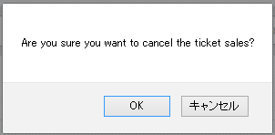

<small></small>

## The State of the Art in Localization

<em><br>Eemeli Aro<br><code>npx eemeli</code></em>

---

<div style="position:relative">

</div>

---

<div style="position:relative">

</div>

---

<small></small>



---

<small></small>

### Tim’s photos

---

<small></small>

### Tim took 1246 photos

---

<small></small>

### Tim took 1,246 photos

---

<small></small>

### Tim took 1,246 photos
### on 5 February 2020

---

<small>Tim took <span style="color:white">1,246</span> photos on 5 February 2020</small>

### Intl.NumberFormat
```js
const nf = new Intl.NumberFormat('en')

nf.format(1246)
// '1,246'
```

---

<small>Tim took 1,246 photos on <span style="color:white">5 February 2020</span></small>

### Intl.DateTimeFormat
```js
const opt = { day: 'numeric', month: 'long', year: 'numeric' }
const dtf = new Intl.DateTimeFormat('en-GB', opt)

const date = new Date(2020, 1, 5) // months are fun.
dtf.format(date)
// '5 February 2020'
```

---

<small>Tim took 1,246 photos on <span style="color:white">February 5, 2020</span></small>

### Intl.DateTimeFormat
```js
const opt = { day: 'numeric', month: 'long', year: 'numeric' }
const dtf = new Intl.DateTimeFormat('en-US', opt)

const date = new Date(2020, 1, 5) // months are fun.
dtf.format(date)
// 'February 5, 2020'
```

---

<small>Tim took 1,246 photos <span style="color:white">2 days ago</span></small>

### Intl.RelativeTimeFormat
<small>Chrome 71 (2018 Dec), Firefox 65 (2019 Jan), Node 12 (2019 April)</small>

```js
const rtf = new Intl.RelativeTimeFormat('en')

rtf.format(-2, 'day')
// '2 days ago'
```

---

<small></small>

### Intl.ListFormat
<small>Chrome 72 (2019 Jan), Node 12 (2019 April)</small>

```js
const opt = { style: 'long', type: 'conjunction' }
const lf = new Intl.ListFormat('en', opt)

const vehicles = ['Motorcycle', 'Bus', 'Car']
lf.format(vehicles)
// 'Motorcycle, Bus, and Car'
```

---

<small><span style="color:white">Tim took 1,246 photos on 5 February 2020</span></small>

### Intl.MessageFormat?

---

<small>Tim took 1,246 photos on 5 February 2020</small>

### Intl.MessageFormat?
<small>Not yet. :(</small>

---

<small><span style="color:white">Tim took 1,246 photos on 5 February 2020</span></small>

### Intl.MessageFormat?

<small>But soon!</small>

github.com/unicode-org/message-format-wg

---

<small>Tim took 1,246 <span style="color:white">photos</span> on 5 February 2020</small>

### Intl.PluralRules
<small>Chrome 63 (2017 Dec), Firefox 58 (2018 Jan), Node 10 (2018 April)</small>

```js
const pr = new Intl.PluralRules('en')

pr.select(1)    // 'one'
pr.select(1246) // 'other'
```

---

<small>Tim took 1,246 <span style="color:white">photos</span> on 5 February 2020</small>

### Intl.PluralRules
<small>Chrome 63 (2017 Dec), Firefox 58 (2018 Jan), Node 10 (2018 April)</small>

```js
const pr = new Intl.PluralRules('en')

pr.select(1)    // 'one' → 'photo'
pr.select(1246) // 'other' → 'photos'
```

<small><br>Polyfill available as `intl-pluralrules`</small>

---

<small>zero / one / two / few / many / other</small>

### Intl.PluralRules

```js
const pr = new Intl.PluralRules('en', { type: 'ordinal' })

pr.select(1)    // 'one' → '1st'
pr.select(2)    // 'two' → '2nd'
pr.select(3)    // 'few' → '3rd'
pr.select(1246) // 'other' → '1246th'
pr.select(42)   // 'two' → '42nd'
```

---

<small>I maintain `messageformat`. It's great.</small>

### Message Formatting Libraries

- FormatJS _– Yahoo (2014)_
- Globalize _– OpenJS Foundation (2010)_
- I18next _– Locize (2012)_
- messageformat _– OpenJS Foundation (2012)_
- Project Fluent _– Mozilla (2017)_

---

<small></small>

### Front-end Environments

- React _– react-intl, react-i18next, @lingui/react, ..._
- Angular _– `<ng i18n>`, ngx-translate, ..._
- Vue _– vue-i18n, vue-i18next, vue-intl_
- Svelte _– svelte-i18n_

---

<small><span style="color:white">Tim took 1246 photos on 5 February 2020</span></small>

### I18next Translations

```json
{
  "photos": "one photo",
  "photos_plural": "{{count}} photos",
  "photos-taken":
    "{{name}} took $t(photos, {'count': {{numPhotos}} }) on {{timestamp}}"
}
```

<small><br>Alternatively, use `i18next-icu` for MessageFormat support</small>

---

<small><span style="color:white">Tim took 1246 photos on 5 February 2020</span></small>

### Polyglot.js Translations

```json
{
  "photos": "one photo |||| %{numPhotos} photos",
  "photos-taken":
    "%{name} took %{photos_as_string} on %{timestamp_as_string}"
}
```

---

<small><span style="color:white">Tim took 1,246 photos on 5 February 2020</span></small>

### ICU MessageFormat

```js
{name} took {numPhotos, plural,
  =0 {no photos}
  one {one photo}
  other {# photos}
} on {timestamp, date, long}
```

---

<small><span style="color:white">Tim took 1,246 photos on 5 February 2020</span></small>

### Project Fluent

```sh
photos-taken = {$name} took {$numPhotos ->
   [0] no photos
   [one] one photo
  *[other] {$numPhotos} photos
} on {DATETIME($timestamp,
  day: "numeric",
  month: "long",
  year: "numeric"
)}
```

---

<small><span style="color:white">Tim took 1,246 photos on 5 February 2020</span></small>

### Project Fluent

```sh
long-date = {DATETIME($timestamp,
  day: "numeric",
  month: "long",
  year: "numeric"
)}

photos-taken = {$name} took {$numPhotos ->
   [0] no photos
   [one] one photo
  *[other] {$numPhotos} photos
} on {long-date}
```

---

<small></small>

### Translation Services

- locize.com
- lokalise.co
- phraseapp.com
- poeditor.com
- transifex.com
- weblate.org
- ...

---

<small>Tim took 1,246 photos on 5 February 2020</small>

### Messages in XLIFF

```xml
<xliff xmlns="urn:oasis:names:tc:xliff:document:2.0"
  version="2.0" srcLang="en-GB" trgLang="en-US">
  <file id="namespace1">
    <unit id="key1">
      <segment>
        <source>{name}’s photos</source>
        <target>...</target>
      </segment>
    </unit>
    <unit id="key2">
      <segment>
        <source>
          {name} took {numPhotos, plural,
            =0 {no photos}
            one {one photo}
            other {# photos}
          } on {timestamp, date, long}
        </source>
        <target>
          ...
        </target>
      </segment>
    </unit>
  </file>
</xliff>
```

---

<small>Tim took 1,246 photos on 5 February 2020</small>

### Messages in .properties

```js
photos-title = {name}’s photos
photos-taken = \
  {name} took {numPhotos, plural, \
    =0 {no photos} \
    one {one photo} \
    other {# photos} \
  } on {timestamp, date, long}
```

---

<small>Tim took 1,246 photos on 5 February 2020</small>

### Messages in JSON

```json
{
  "photos-title": "{name}’s photos",
  "photos-taken":
    "{name} took {numPhotos, plural, =0 {no photos} one {one photo} other {{numPhotos, number} photos}} on {timestamp, date, long}"
}
```

---

<small>Tim took 1,246 photos on 5 February 2020</small>

### Messages in YAML

```yaml
photos-title: '{name}’s photos'
photos-taken: |
  {name} took {numPhotos, plural,
    =0 {no photos}
    one {one photo}
    other {{numPhotos, number} photos}
  } on {timestamp, date, long}
```

---

<div style="position:relative; background:white">

<div style="background:white;color:black;font-family:'Comic Sans MS';font-size:60px;position:absolute;top:30px;left:70px">TRANSPILE</div>
</div>

---

<small>webpack.config.js</small>

```sh
npm i -D messageformat@next messageformat-loader@next
```

```js
module.exports = {
  ...,
  module: {
    rules: [
      {
        test: /\bmessages\.(json|ya?ml)$/,
        type: 'javascript/auto', // required to load JSON as JS
        loader: 'messageformat-loader',
        options: { locale: ['en-GB'] }
      }
    ]
  }
}
```

---

<small><span style="color:white">Tim took 1,246 photos on 5 February 2020</span></small>

```js
import messages from './messages.yaml'

const msg = messages['photos-taken']
const timestamp = new Date(2020, 1, 5)

msg({ name: 'Tim', numPhotos: 1246, timestamp })
// 'Tim took 1,246 photos on 5 February 2020'
```

---

<small><span style="color:white">Tim took 1,246 photos on 5 February 2020</span></small>

```sh
npm i react-message-context
```

```js
import React from 'react'
import { MessageProvider, useMessage } from 'react-message-context'
import messages from './messages.yaml'

function Tim({ numPhotos, timestamp }) {
  const msg = useMessage('photos-taken')
  return msg({ name: 'Tim', numPhotos, timestamp })
}

export const TimApp = () =>
  <MessageProvider messages={messages}>
    <Tim numPhotos={1246} timestamp={new Date(2020, 1, 5)} />
  </MessageProvider>

// 'Tim took 1,246 photos on 5 February 2020'
```

---

<small>To start, localization doesn’t have to make sense.</small>

```js
export function msg(strings, ...values) {
  if (typeof strings === 'string') return strings
  let res = ''
  for (let i = 0; i < values.length; ++i) {
    res += strings[i] + values[i]
  }
  return res + strings[strings.length - 1]
}

const name = 'Tim'
msg(name + '’s photos') // 'Tim’s photos'
msg`${name}’s photos`   // 'Tim’s photos'
```

---

<small>It can be just as dumb in React.</small>

```js
import React from 'react'

export const Msg = ({ children }) => children

function TimTitle() {
  const name = 'Tim'
  return <Msg>{name}’s photos</Msg>
}
```

---

<small>Too long; didn't listen</small>

* Fixing localization earlier is less work.
* When you can, use standard features.
* Don't roll your own message formatter.
* Message data is really rather simple.
* Translators are not engineers.
* If you care, participate! Not enough people care.

---

<small></small>

## Kotoistamisen huippuluokka

<em><br>
@eemeli_aro<br>
eemeli.org/talks/state-of-localization</em>


