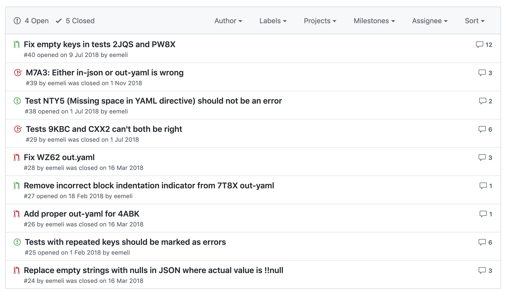

<small></small>

## The UX of Configuration Files

<em><code><br>npx eemeli</code></em>


---

<small></small>

### Configuration File Formats

- Some are simple
- Some are not so simple
- Some are Turing-complete

---

<small>en.wikipedia.org/wiki/.properties</small>

### .properties

```sh
website = https://en.wikipedia.org/
language = English
# The backslash below tells the application to continue reading
# the value onto the next line.
message = Welcome to \
          Wikipedia!
# Add spaces to the key
key\ with\ spaces = This is the value that could be looked up with the key "key with spaces".
# Unicode
tab : \u0009
# If you want your property to include a backslash, it should be escaped by another backslash
path=c:\\wiki\\templates
```

<small><code>npm install dot-properties</code></small>

---

<small>github.com/toml-lang/toml</small>

### TOML

```ini
# This is a TOML document.
title = "TOML Example"

[owner]
name = "Tom Preston-Werner"
dob = 1979-05-27T07:32:00-08:00 # First class dates

[database]
server = "192.168.1.1"
ports = [ 8001, 8001, 8002 ]
connection_max = 5000
enabled = true

[servers]

  # Indentation (tabs and/or spaces) is allowed but not required
  [servers.alpha]
  ip = "10.0.0.1"
  dc = "eqdc10"

  [servers.beta]
  ip = "10.0.0.2"
  dc = "eqdc10"

[clients]
data = [ ["gamma", "delta"], [1, 2] ]

# Line breaks are OK when inside arrays
hosts = [
  "alpha",
  "omega"
]
```

---

<small>sdlang.org</small>

### SDLang

```js
// This is a node with a single string value
title "Hello, World"

// Multiple values are supported, too
bookmarks 12 15 188 1234

// Nodes can have attributes
author "Peter Parker" email="peter@example.org" active=true

// Nodes can be arbitrarily nested
contents {
	section "First section" {
		paragraph "This is the first paragraph"
		paragraph "This is the second paragraph"
	}
}

// Anonymous nodes are supported
"This text is the value of an anonymous node!"

// This makes things like matrix definitions very convenient
matrix {
	1 0 0
	0 1 0
	0 0 1
}
```

---

<small>json.org</small>

### JSON

```json
{
  "first name": "John",
  "last name": "Smith",
  "age": 25,
  "address": {
    "street address": "21 2nd Street",
    "city": "New York",
    "state": "NY",
    "postal code": "10021"
  },
  "phone numbers": [
    {
      "type": "home",
      "number": "212 555-1234"
    },
    {
      "type": "fax",
      "number": "646 555-4567"
    }
  ],
  "sex": {
    "type": "male"
  }
}
```

---


---

<small>github.com/Microsoft/node-jsonc-parser</small>

### JSON with Comments

```js
// comment
{
  "data": /* comment */ "value"
}
```

---

<small>json5.org</small>

### JSON5

```js
{
  // comments
  unquoted: 'and you can quote me on that',
  singleQuotes: 'I can use "double quotes" here',
  lineBreaks: "Look, Mom! \
No \\n's!",
  hexadecimal: 0xdecaf,
  leadingDecimalPoint: .8675309, andTrailing: 8675309.,
  positiveSign: +1,
  trailingComma: 'in objects', andIn: ['arrays',],
  "backwardsCompatible": "with JSON",
}
```

---

<small>hjson.org</small>

### Hjson

```js
{
  // omit quotes for keys
  key: 1
  // omit quotes for strings
  contains: everything on this line
  // omit commas at the end of a line
  cool: {
    foo: 1
    bar: 2
  }
  // allow trailing commas
  list: [
    1,
    2,
  ]
  // and use multiline strings
  realist:
    '''
    My half empty glass,
    I will fill your empty half.
    Now you are half full.
    '''
}
```

---

<small>github.com/lightbend/config/blob/master/HOCON.md</small>

### HOCON

```json
HOCON = Human-Optimized Config Object Notation
"it's": "a JSON superset",
features: [
    less noisy / less pedantic syntax
    ability to refer to another part of the configuration
    import/include another configuration file into the current file
    ability to get values from environment variables
    # ability to write comments
]
it's: ${it's}. A ${HOCON}
```

---

<small>yaml.org</small>

### YAML

```yaml
receipt:     Oz-Ware Purchase Invoice
date:        2012-08-06
customer:
    first_name:   Dorothy
    family_name:  Gale

items:
    - part_no:   A4786
      descrip:   Water Bucket (Filled)
      price:     1.47
      quantity:  4

    - part_no:   E1628
      descrip:   High Heeled "Ruby" Slippers
      size:      8
      price:     133.7
      quantity:  1

bill-to:  &id001
    street: |
            123 Tornado Alley
            Suite 16
    city:   East Centerville
    state:  KS

ship-to:  *id001

specialDelivery:  >
    Follow the Yellow Brick
    Road to the Emerald City.
    Pay no attention to the
    man behind the curtain.
```

---

<small>hitchdev.com/strictyaml</small>

### StrictYAML

```yaml
# All about the character
name: Ford Prefect
age: 42
possessions:
- Towel
```

---

<small>dhall-lang.org</small>

### Dhall

```text
let Config =
      { home : Text
      , privateKey : Text
      , publicKey : Text
      }

let makeUser = \(user : Text) ->
      let home       = "/home/${user}"
      let privateKey = "${home}/.ssh/id_ed25519"
      let publicKey  = "${privateKey}.pub"
      in  { home = home
          , privateKey = privateKey
          , publicKey = publicKey
          }

let buildUser = \(index : Natural) ->
      {- `Natural/show` is a "built-in", meaning that
         you can use `Natural/show` without an import
      -}
      makeUser "build${Natural/show index}"

-- Use the `generate` function from the Dhall Prelude
let generate = https://prelude.dhall-lang.org/List/generate

in
    generate 10 Config buildUser
```


<small>dhall-lang.org</small>

### Dhall

```json
[
  {
    "home": "/home/build0",
    "privateKey": "/home/build0/.ssh/id_ed25519",
    "publicKey": "/home/build0/.ssh/id_ed25519.pub"
  },
  {
    "home": "/home/build1",
    "privateKey": "/home/build1/.ssh/id_ed25519",
    "publicKey": "/home/build1/.ssh/id_ed25519.pub"
  },
  ...
]
```

---

<small>jsonnet.org</small>

### Jsonnet

```js
// A function that returns an object.
local Person(name='Alice') = {
  name: name,
  welcome: 'Hello ' + name + '!',
};
{
  person1: Person(),
  person2: Person('Bob'),
}
```


<small>jsonnet.org</small>

### Jsonnet

```json
{
  "person1": {
    "name": "Alice",
    "welcome": "Hello Alice!"
  },
  "person2": {
    "name": "Bob",
    "welcome": "Hello Bob!"
  }
}
```


<small>jsonnet.org</small>

### Jsonnet

```js
local application = 'my-app';
local module = 'uwsgi_module';
local dir = '/var/www';
local permission = 644;

{
  'uwsgi.ini': std.manifestIni({
    sections: {
      uwsgi: {
        module: module,
        pythonpath: dir,
        socket: dir + '/uwsgi.sock',
        'chmod-socket': permission,
        callable: application,
        logto: '/var/log/uwsgi/uwsgi.log',
      },
    },
  }),

  'init.sh': |||
    #!/bin/bash
    mkdir -p %(dir)s
    touch %(dir)s/initialized
    chmod %(perm)d %(dir)s/initialized
  ||| % {dir: dir, perm: permission},

  'cassandra.conf': std.manifestYamlDoc({
    cluster_name: application,
    seed_provider: [
      {
        class_name: 'SimpleSeedProvider',
        parameters: [{ seeds: '127.0.0.1' }],
      },
    ],
  }),
}
```

---

<small>cuelang.org</small>

### CUE

```yaml
// comments
point: {
    x: number
    y: number
}

xaxis: point
xaxis x: 0
yaxis: point
yaxis y: 0

{
  one: 1
  "two million": 2M
  outer middle inner: 3
  origin: xaxis & yaxis
}
```


<small>cuelang.org</small>

### CUE

```json
{
    "one": 1,
    "two million": 2000000,
    "outer": {
        "middle": {
            "inner": 3
        }
    },
    "origin": { "x": 0, "y": 0 }
}
```

---

<small>lmgtfy.com/?q=javascript</small>

### JavaScript

```js
const path = require('path')

module.exports = {
  output: {
    filename: 'bundle.js',
    path: path.resolve(__dirname, 'build')
  },
  module: {
    rules: [
      {
        test: /\.jsx?$/,
        exclude: /node_modules/,
        loader: 'babel-loader'
      }
    ]
  }
}
```


<small></small>

### Python

```python
import preprocessing

mysql = {'host': 'localhost',
         'user': 'root',
         'passwd': 'my secret password',
         'db': 'write-math'}
preprocessing_queue = [preprocessing.scale_and_center,
                       preprocessing.dot_reduction,
                       preprocessing.connect_lines]
use_anonymous = True
```

---

<small></small>

### Why does this matter?

- Why do I care about any of this?
- Does anyone else care?
- Why should <b style="color:#e7ad52">you</b> care?

---

<small></small>

### Just write some comments.

```js
import msg from 'messages' // still a work in progress

function Foo({ isRed }) {
  const doorColor = isRed ? 'red' : 'blue'
  // There is only one door.
  const doorMsg = msg`The door is ${doorColor}`
  ...
}
```

_(insert magic here)_

```yaml
# Source: Foo() in file.js, line 6
# Context: There is only one door.
doorMsg: The door is {doorColor}
```


<small><code>npm install yaml</code></small>

### Just write some comments.

```js
import YAML from 'yaml'

const doc = new YAML.Document()
doc.commentBefore = ' A commented document'
doc.contents = ['some', 'values', { balloons: 99 }]
String(doc)
```

```yaml
# A commented document

- some
- values
- balloons: 99
```

---

<small>github.com/yaml/yaml-test-suite</small>



---

<small>projectfluent.org</small>

### Fluent

```ini
## Closing tabs
tabs-close-button = Close
tabs-close-tooltip = {$tabCount ->
    [one] Close {$tabCount} tab
   *[other] Close {$tabCount} tabs
}
tabs-close-warning =
    You are about to close {$tabCount} tabs.
    Are you sure you want to continue?

## Syncing
-sync-brand-name = Firefox Account
sync-dialog-title = {-sync-brand-name}
sync-headline-title =
    {-sync-brand-name}: The best way to bring
    your data always with you
sync-signedout-title =
    Connect with your {-sync-brand-name}
```

---

<small>arewefluentyet.com</small>


---

<small></small>

### Who cares about your config?


<small>UX matters even for developers</small>

### Who uses your app/library/whatever?

---

<small></small>

### Limit your assumptions

```js
import YAML from 'yaml'

const src = `
  boolean: true
  norway: no
`

YAML.parse(src)
{ boolean: true, norway: 'no' }
```


<small>Whoever said YAML had any footguns?</small>

### Limit your assumptions

```js
import YAML from 'yaml'

const src = `
  boolean: true
  norway: no
`

YAML.parse(src, { version: '1.2' }) // published 2009
{ boolean: true, norway: 'no' }

YAML.parse(src, { version: '1.1' }) // published 2004
{ boolean: true, norway: false }
```


<small>Whoever said YAML had any footguns?</small>

### Limit your assumptions

```js
import YAML from 'yaml'

const src = `
  boolean: true
  norway: no
`

YAML.parse(src, { version: '1.2' }) // published 2009
{ boolean: true, norway: 'no' }

YAML.parse(src, { version: '1.1' }) // published 2004
{ boolean: true, norway: false }

YAML.parse(src, { version: '1.2', schema: 'failsafe' })
{ boolean: 'true', norway: 'no' }
```

---

<small><code>brew install cuelang/tap/cue</code></small>

### Validation with CUE

```yaml
# ranges.yaml
min: 5
max: 10
---
min: 10
max: 5
```

```js
// check.cue
min?: *0 | number    // 0 if undefined
max?: number & >min  // must be greater than min if defined
```

```sh
$ cue vet ranges.yaml check.cue
max: invalid value 5 (out of bound >10):
    ./check.cue:3:16
    ./ranges.yaml:6:7
```

---

<small>json-schema.org</small>

### Validation with JSON Schema

```js
import Ajv from 'ajv' // npm install ajv

const schema = {
  properties: {
    foo: { type: 'number' },
    bar: { const: { '$data': '1/foo' } }
  }
}

const ajv = new Ajv({ $data: true })

ajv.validate(schema, { foo: 3 }) // true
ajv.validate(schema, { foo: '3' }) // false
ajv.validate(schema, { foo: 3, bar: undefined }) // false
ajv.validate(schema, { foo: 3, bar: 3 }) // true
```

---

<small>json-schema.org</small>

### Syntax Highlighting!

```yaml
# VSCode settings.json
{
  "json.schemas": [
    {
      "fileMatch": [ "/.babelrc" ],
      "url": "http://json.schemastore.org/babelrc"
    }
  ]
}
```
<small><span>For YAML support, install the VS Code extension</span> <a href="https://marketplace.visualstudio.com/items?itemName=redhat.vscode-yaml">redhat.vscode-yaml</a></small>
<small><span>IntelliJ IDEA:</span> www.jetbrains.com/help/idea/json.html</small>

---

<small>yargs.js.org</small>

### Yargs

```js
// pirate-parser.js
require('yargs')
  .scriptName("pirate-parser")
  .usage('$0 <cmd> [args]')
  .command('hello [name]', 'welcome ter yargs!', (yargs) => {
    yargs.positional('name', {
      type: 'string',
      default: 'Cambi',
      describe: 'the name to say hello to'
    })
  }, function (argv) {
    console.log('hello', argv.name, 'welcome to yargs!')
  })
  .help()
  .argv
```


<small>yargs.js.org</small>

### Yargs

```text
$ node pirate-parser.js --help

pirate-parser <cmd> [args]

  Commands:
    pirate-parser hello [name]  welcome ter yargs!

  Options:
    --help  Show help                                                    [boolean]
```

---

<small></small>

## The UX of Configuration Files

<em><br>
@eemeli_aro<br>
eemeli.org/talks/ux-of-config-files</em>


